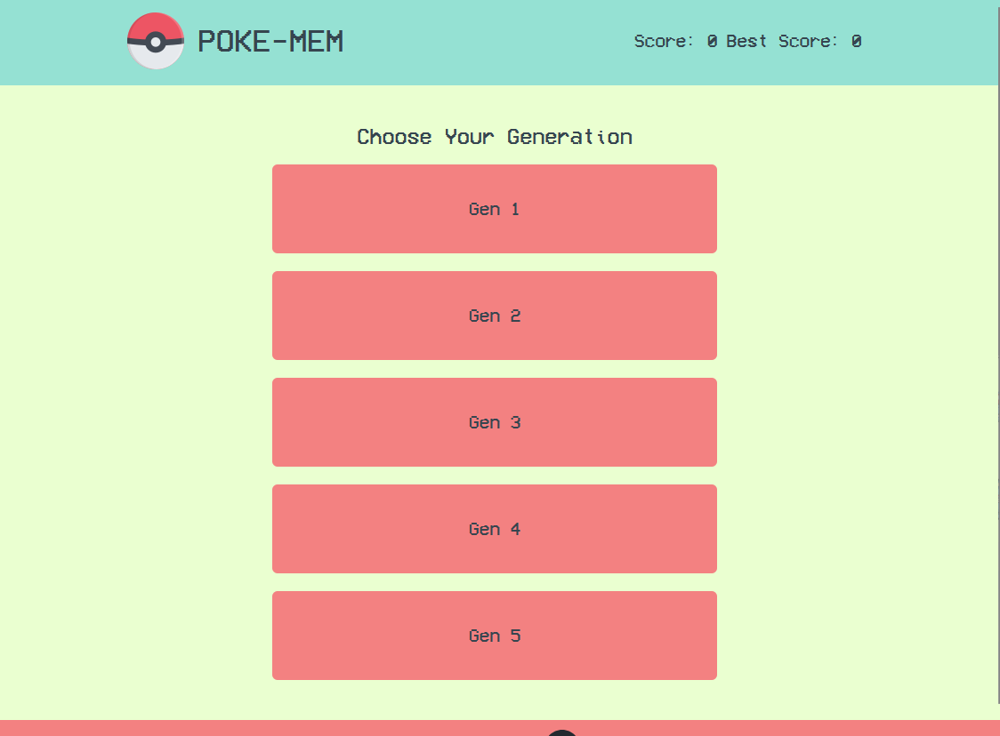
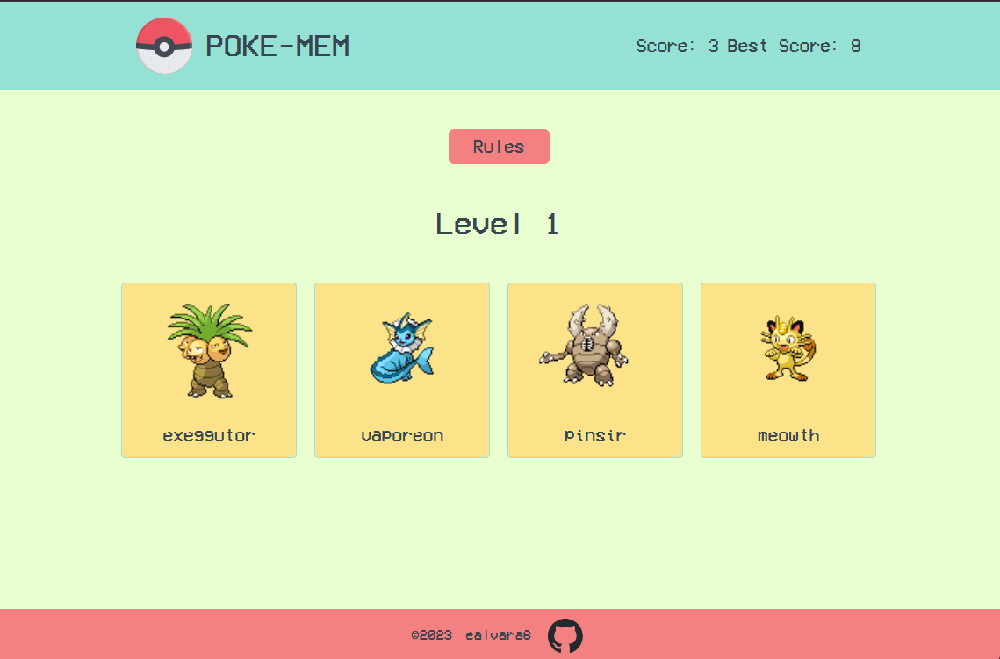

# Poke-Mem
This project is part of the [Odin Project](https://www.theodinproject.com/) full stack web development course. I utilized the [PokeAPI](https://pokeapi.co/) to fetch pokemon data inside of the useEffect hook.
Poke-Mem is a memory card game that lets you choose between pokemon generations 1-5. a set of pokemon are displayed and you must click on each pokemon once to advance to the next level.

# Live Demo
[PokeMem](https://poke-mem-xi.vercel.app/)

# Local Install
```
git clone https://github.com/ealvara6/Poke-Mem.git
cd Poke-Mem
inpm install npm run dev
```

# Preview
### Menu


### Level


# Features
- Dynamic data fetching from PokéAPI
- Persitant score tracking with localStorage
- game logic to track selections and prevent duplicates
- Difficulty increase after each round
- Randomized card shuffling for replayability
- Complex state management for game flow and UI updates

# Credits

header icon - <a href="https://www.flaticon.com/free-icons/pokemon" title="pokemon icons">Pokemon icons created by Nikita Golubev - Flaticon</a>
